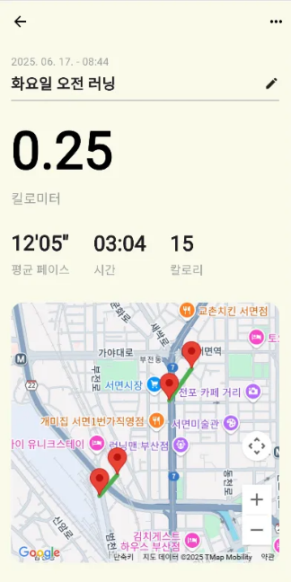

# 러닝 마니아들을 위한 러닝 커뮤니티 플랫폼

## 🎥 시연영상

<video src="https://github.com/user-attachments/assets/4880440a-309b-4640-8ae1-b48c25469489" controls width="600"></video>

## 목차

1. [🗓️ 개발 기간 및 참여 인원](#개발기간및참여인원)
2. [🔚 회고](#회고)
3. [💡 주요 기능](#주요기능)
4. [✍️ 개인 기여도 및 역할](#개인기여도및역할)
5. [👥 백엔드-팀원](#백엔드팀원)
6. [🛠️ 기술 스택](#기술스택)
7. [🧩 문제 해결 경험](#문제해결경험)
8. [🗂️ ERD](#erd)
9. [📄 API 문서](#api문서)

## 🗓️ 개발 기간 및 참여 인원

- 기간: 2025.06.16 ~ 2025.07.17
- 인원: 7인 팀 프로젝트

## 🔚 회고

1️⃣ **샘플링을 통한 빠른 신기술 적용**

이번 프로젝트에서 Firebase FCM을 처음 사용해 보았습니다. FCM을 사용한 이유는 앱이 백그라운드 상태에서도 휴대폰에 알림을 보내기 위해서였습니다.

FCM을 프로젝트에 적용하기 전에, 먼저 동작 원리를 이해하고 안정적으로 적용하기 위해 샘플링을 진행했습니다. 플러터와 스프링용 샘플 프로젝트를 만들어 GPT의 안내에 따라 단계별로 구현하며 동작을 확인했습니다.

샘플링을 통해 동작을 확인한 뒤, 사용법과 코드를 정리하여 실제 프로젝트에 적용했습니다. 스프링 부분은 제가 직접 적용했고, 플러터 부분은 제가 정리한 사용법과 코드를 기반으로 프론트 팀에서 적용했습니다.

이 과정을 통해, 바로 본 프로젝트에서 코드를 작성하는 것보다 문제 없는 상태의 코드를 먼저 확인하고 적용함으로써 더 빠르고 안정적으로 기능을 구현할 수 있었습니다.

2️⃣ **CICD를 통한 서비스 배포 과정 경험**

본 프로젝트에서 처음으로 CICD 를 해보았습니다. 통합테스트를 작성해 로컬에서 테스트 해보고, 깃허브액션에 배포해서 리눅스 테스트 환경에서 테스트 해보고 마지막으로 elb 에 배포해서 실제 배포 환경에서도 동작하는
것을 확인할 수 있었습니다.

처음에는 로컬에서 테스트가 성공하여 이대로면 문제없이 배포 완료 될 것 같다는 생각을 했습니다. 그래서 CICD 배포를 진행하였는데 깃허브 액션과 elb 에서 문제가 생겨서 이 문제를 해결하는데 많이 고생했습니다.
각각의 다른 환경에서 환경변수를 읽어오는 과정에서 차이가 발생하여 배포가 제대로 되지 않았습니다. elb 콘솔에 들어가서 로그를 확인하고 문제점을 찾은 다음 하루 정도의 시간이 걸려서 해당 문제를 해결했습니다. 결국
마지막에 배포를 성공적으로 완료할 수 있었습니다.

CICD 를 해보면서 개발 중인 로컬환경과 테스트 서버환경, 실제 배포 서버의 환경이 다르다는 것을 직접 느껴볼 수 있었습니다.

본 프로젝트에서 처음으로 CICD 를 적용해보았습니다. 먼저 통합 테스트를 작성하고 로컬에서 검증한 뒤, 깃허브액션을 통해 리눅스 테스트 환경에 배포하여 테스트했습니다. 마지막으로 ELB 를 통해 실제 배포
환경에서도 동작을 확인할 수 있었습니다.

처음에는 로컬 테스트가 성공했기 때문에 문제 없이 배포될 것이라 생각했으나, 깃허브액션과 ELB 환경에서 문제가 발생했습니다. 원인은 서로 다른 환경에서 환경 변수를 읽어오는 방식의 차이였습니다. ELB 콘솔에서
로그를 확인하며 문제점을 분석했고, 하루 정도의 시간 끝에 문제를 해결할 수 있었습니다.

이 경험을 통해 로컬 개발 환경, 테스트 서버 환경, 실제 배포 환경이 다르다는 것을 직접 체감했고, 환경별 차이를 고려한 배포 과정의 중요성을 배울 수 있었습니다.

## 💡 주요 기능

- 러닝 기록 저장
- 러닝 기록 통계 확인
- 러닝 뱃지, 레벨등 보상 확인
- 챌린지를 통해서 타인과 기록 경쟁 가능
- 러닝 플랜을 통해 러닝 계획 수행에 도움
- 러닝 기록을 게시글로 작성해 러닝 기록 공유 가능

## ✍️ 개인 기여도 및 역할

- 러닝기록 CRUD
    - 러닝 기록 받고 좌표, 이동거리, 시간 등을 계산해서 저장
- 러닝 뱃지 획득
    - 러닝 기록 등록시 뱃지 획득 조건을 달성하면 러닝 기록이 뱃지를 획득함
- 러닝 레벨업
    - 러닝 기록 등록시 레벨 획득 조건을 달성하면 러닝 레벨이 증가
- 러닝 챌린지
    - 공개챌린지에 참여하여 챌린지를 달성하고 뱃지 보상 획득 및 사설챌린지 개설해서 친구들과 챌린지 진행
- 카카오 OIDC 로그인
    - 카카오에서 제공하는 OIDC 토큰을 사용해서 회원가입 및 로그인 처리
- 파이어베이스 FCM 알림
    - 파이어베이스에서 제공하는 FCM SDK 를 사용해 앱 알림 구현
- RestDoc api 문서 작성
    - 통합테스트 작성 후 restdoc 라이브러리로 api 문서 작성
- aws 배포
    - 깃허브 액션과 aws ELB 를 사용하여 CICD 구현
- sentry io 연결
    - 서버 배포 후 500번대 에러를 신속히 확인하기 위해서 sentry io 연결후 에러 로그 확인

## 👥 백엔드 팀원

| 이름  | 역할  | GitHub                                       |
|-----|-----|----------------------------------------------|
| 문정준 | 팀장  | [@Sxias](https://github.com/Sxias)           |
| 최재원 | 부팀장 | [@jjack-1](https://github.com/jjack-1)       |
| 편준민 | 팀원  | [@JunMin0529](https://github.com/JunMin0529) |
| 김세리 | 팀원  | [@roni243](https://github.com/roni243)       |

 

## 🛠️ 기술 스택

<table>
    <tr>
        <td align="center"> Java</td>
        <td align="center"> Spring Boot</td>
        <td align="center"> RestDoc</td>
        <td align="center"> JPA(Hibernate)</td>
        <td align="center"> H2</td>
        <td align="center"> MySQL</td>
    </tr>
</table>
<table>
    <tr>
        <td align="center"> FCM</td>
        <td align="center"> Kakao OIDC</td>
        <td align="center"> Github Action</td>
        <td align="center"> aws</td>
        <td align="center"> Sentry</td>
    </tr>
</table>

## 🧰 개발 환경

<table>
    <tr>
        <td align="center"> IntelliJ</td>
    </tr>
</table>

## 🤝 협업 도구

<table>
    <tr>
        <td align="center"> Git</td>
        <td align="center"> GitHub</td>
        <td align="center"> Notion</td>
        <td align="center"> Slack</td>
    </tr>
</table>

## 🧩 문제 해결 경험 및 회고

### 🔔 문제1 : 환경변수 등록 문제

- **✅ 문제 상황**
    - PEM 기반의 FCM SDK Key를 환경변수로 받아서 처리하였다
    - CICD 과정에서 로컬, 깃허브 액션에선 문제가 없었으나, aws elb 환경에서 환경변수를 가져올 때 문제가 발생하였다
        - PEM 기반의 문자열은 \n 이라는 줄바꿈 문자가 들어가 있다
        - aws elb 에선 환경변수를 가져올 때 시스템에서 직접 문자 그대로 가져오는게 아니라 쉘 스크립트로 읽어서 환경변수를 따로 저장하는 어플리케이션에게 전달하고 이 어플리케이션에게 환경변수를 요청하는
          것 이다
        - 이 쉘스크립트가 환경변수를 읽을 때 \n이 포함된 문자열을 읽을 때 \를 이스케이프 명령으로 해석하고 제거하게 된다. 그래서 n만 남은 문자열이 들어오기 때문에 정상적인 Key 가 아니라서 FCM
          초기화 문제가 발생하였다
- **🔧 해결 방법**:
    - \n 이 포함된 문자열을 base64 로 인코딩해서 전달하고 스프링 앱에서 가져와서 디코딩 후 사용하는 방법으로 해결하였다
- 💡 **느낀 점**
    - \ 가 들어가 있는 문자열을 환경변수로 사용하게 될 때는 이 문자열을 base64로 인코딩하는 방법이 가장 간단한 방법인것 같다. base64 인코딩으로 원본데이터에서 \ 만 표기되지 않게 그대로 전달하고
      스프링에서 디코딩해서 사용하면 되기 때문이다
    - 로컬, 깃허브액션(리눅스), aws elb 환경에서 환경변수를 가져오는 방법이 각자 다르기 때문에 각 환경에서 문제가 있나 없나 잘 확인을 해봐야 할것 같다. 각 환경의 차이점을 잘 정리해서 다음에 또
      같은 문제가 발생하면 바로바로 해결해야겠다

## 🗂️ ERD

## 📄 API 문서

