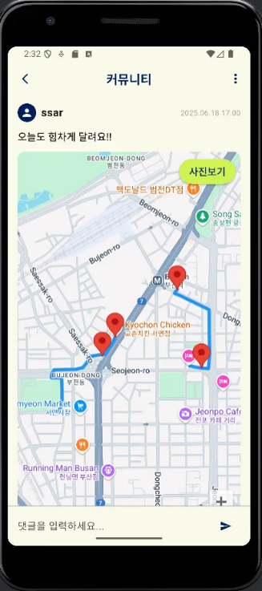

# 러닝 마니아들을 위한 러닝 커뮤니티 플랫폼

## 🎥 시연영상

<video src="https://github.com/user-attachments/assets/4880440a-309b-4640-8ae1-b48c25469489" controls width="600"></video>

## 목차

1. [🗓️ 개발 기간 및 참여 인원](#개발기간및참여인원)
2. [🔚 회고](#회고)
3. [💡 주요 기능](#주요기능)
4. [✍️ 개인 기여도 및 역할](#개인기여도및역할)
5. [👥 백엔드-팀원](#백엔드팀원)
6. [🛠️ 기술 스택](#기술스택)
7. [🧩 문제 해결 경험](#문제해결경험)
8. [🗂️ ERD](#erd)
9. [📄 API 문서](#api문서)
10. [🧠 프로젝트 소개](#프로젝트소개)

## 🗓️ 개발 기간 및 참여 인원

- 기간: 2025.06.16 ~ 2025.07.17
- 인원: 7인 팀 프로젝트

## 🔚 회고

1️⃣ **샘플링을 통한 빠른 신기술 적용**

이번 프로젝트에서 Firebase FCM을 처음 사용해 보았습니다. FCM을 사용한 이유는 앱이 백그라운드 상태에서도 휴대폰에 알림을 보내기 위해서였습니다.

FCM을 프로젝트에 적용하기 전에, 먼저 동작 원리를 이해하고 안정적으로 적용하기 위해 샘플링을 진행했습니다. 플러터와 스프링용 샘플 프로젝트를 만들어 GPT의 안내에 따라 단계별로 구현하며 동작을 확인했습니다.

샘플링을 통해 동작을 확인한 뒤, 사용법과 코드를 정리하여 실제 프로젝트에 적용했습니다. 스프링 부분은 제가 직접 적용했고, 플러터 부분은 제가 정리한 사용법과 코드를 기반으로 프론트 팀에서 적용했습니다.

이 과정을 통해, 바로 본 프로젝트에서 코드를 작성하는 것보다 문제 없는 상태의 코드를 먼저 확인하고 적용함으로써 더 빠르고 안정적으로 기능을 구현할 수 있었습니다.

2️⃣ **CICD를 통한 서비스 배포 과정 경험**

본 프로젝트에서 처음으로 CICD 를 해보았습니다. 통합테스트를 작성해 로컬에서 테스트 해보고, 깃허브액션에 배포해서 리눅스 테스트 환경에서 테스트 해보고 마지막으로 elb 에 배포해서 실제 배포 환경에서도 동작하는
것을 확인할 수 있었습니다.

처음에는 로컬에서 테스트가 성공하여 이대로면 문제없이 배포 완료 될 것 같다는 생각을 했습니다. 그래서 CICD 배포를 진행하였는데 깃허브 액션과 elb 에서 문제가 생겨서 이 문제를 해결하는데 많이 고생했습니다.
각각의 다른 환경에서 환경변수를 읽어오는 과정에서 차이가 발생하여 배포가 제대로 되지 않았습니다. elb 콘솔에 들어가서 로그를 확인하고 문제점을 찾은 다음 하루 정도의 시간이 걸려서 해당 문제를 해결했습니다. 결국
마지막에 배포를 성공적으로 완료할 수 있었습니다.

CICD 를 해보면서 개발 중인 로컬환경과 테스트 서버환경, 실제 배포 서버의 환경이 다르다는 것을 직접 느껴볼 수 있었습니다.

본 프로젝트에서 처음으로 CICD 를 적용해보았습니다. 먼저 통합 테스트를 작성하고 로컬에서 검증한 뒤, 깃허브액션을 통해 리눅스 테스트 환경에 배포하여 테스트했습니다. 마지막으로 ELB 를 통해 실제 배포
환경에서도 동작을 확인할 수 있었습니다.

처음에는 로컬 테스트가 성공했기 때문에 문제 없이 배포될 것이라 생각했으나, 깃허브액션과 ELB 환경에서 문제가 발생했습니다. 원인은 서로 다른 환경에서 환경 변수를 읽어오는 방식의 차이였습니다. ELB 콘솔에서
로그를 확인하며 문제점을 분석했고, 하루 정도의 시간 끝에 문제를 해결할 수 있었습니다.

이 경험을 통해 로컬 개발 환경, 테스트 서버 환경, 실제 배포 환경이 다르다는 것을 직접 체감했고, 환경별 차이를 고려한 배포 과정의 중요성을 배울 수 있었습니다.

## 💡 주요 기능

- 팀·선수별 데이터 기반 승리 예측 & 스코어 예측
- 날씨 데이터 연동을 통한 경기 우천 취소 예측
- 최근 팀 간 전적 / 승패 통계 / 타자 vs 투수 대결 기록 등 통계 제공
- 동행 모집 / 직관 기록 / 팬 활동 기록 관리.
- 예측 콘텐츠 제공 및 리워드 시스템
    - 사용자가 경기 승리팀을 예측하면 포인트를 획득하고, 누적 포인트에 따라 티어(등급)가 상승하는 구조로, 팬의 참여도를 높이고 재미 요소를 강화

## ✍️ 개인 기여도 및 역할

### 개인

- 타자 라인업 크롤링
    - KBO 공식 사이트에서 각 경기의 타자 라인업 데이터 수집하여 저장
- 선발 투수 라인업 크롤링
    - KBO 공식 사이트에서 선발 투수 정보를 크롤링하여 저장
- 기상청 날씨 API
    - 기상청 단기/초단기 예보 API를 통해 경기장별 날씨 정보 저장
- 우천 취소 예측
    - 날씨 및 기상 데이터를 기반으로 경기 우천 취소 여부 예측 기능
- 경기 전력분석 기능 상대 전적
    - 두 팀 간의 최근 맞대결 전적 통계 조회 기능
- 직관 기록 CRUD
    - 사용자의 직관(직접 관람) 기록을 생성, 조회, 수정, 삭제하는 기능
- 알림 기능 구현 (FCM)
    - 선발 투수 확정, 경기 시작 시간 등 주요 이벤트 발생 시 사용자에게 푸시 알림 전송
- 사용자 맞춤형 홈 화면 개발
    - 앱 첫 화면 구성 및 사용자 맞춤형 주요 정보 표시

### 공통

- ERD/테이블 설계
    - 기초테이블, 행위테이블 설계
- 컨벤션, Git 형상관리 방식 기획
    - Git에 서버용 레파지토리 2개와 Flutter앱용 레파지토리 생성
    - 기본적인 컨벤션을 예전 프로젝트들로 부터 참고하여 작성

# 파이널프로젝트 - 중개플랫폼 웹/앱 : Tracky

- 자바와 스프링부트를 활용하여 Rest API 서버를 제작하였습니다.
- 전체 개발 기간 : 2025.06.16 ~ 2025.07.18
   

## 앱 레퍼런싱

- Nike Run Club 앱을 리퍼런싱 하여 제작하였습니다.

## 👥 백엔드 팀원

| 이름  | 역할  | GitHub                                       |
|-----|-----|----------------------------------------------|
| 문정준 | 팀장  | [@Sxias](https://github.com/Sxias)           |
| 최재원 | 부팀장 | [@jjack-1](https://github.com/jjack-1)       |
| 편준민 | 팀원  | [@JunMin0529](https://github.com/JunMin0529) |
| 김세리 | 팀원  | [@roni243](https://github.com/roni243)       |

 

## 🛠️ 기술 스택

<table>
    <tr>
        <td align="center"> Java</td>
        <td align="center"> Spring Boot</td>
        <td align="center"> RestDoc</td>
        <td align="center"> JPA(Hibernate)</td>
        <td align="center"> H2</td>
        <td align="center"> MySQL</td>
    </tr>
</table>
<table>
    <tr>
        <td align="center"> FCM</td>
        <td align="center"> Kakao OIDC</td>
        <td align="center"> Github Action</td>
        <td align="center"> aws</td>
        <td align="center"> Sentry</td>
    </tr>
</table>

## 🧰 개발 환경

<table>
    <tr>
        <td align="center"> IntelliJ</td>
    </tr>
</table>

## 🤝 협업 도구

<table>
    <tr>
        <td align="center"> Git</td>
        <td align="center"> GitHub</td>
        <td align="center"> Notion</td>
        <td align="center"> Slack</td>
    </tr>
</table>

 

# 📋 프로젝트 업무 분담

<table style="width: 100%; text-align: start; font-size: 16px; border-collapse: collapse;">
    <thead style="background-color: #f2f2f2;">
        <tr>
            <th style="padding: 10px; border: 1px solid #ddd;">담당자</th>
            <th style="padding: 10px; border: 1px solid #ddd;">프로젝트 업무 분담</th>
        </tr>
    </thead>
    <tbody>
        <tr>
            <td style="padding: 10px; border: 1px solid #ddd;">문정준</td>
            <td style="padding: 10px; border: 1px solid #ddd;">
                <ul>
                    <li>프로젝트 계획 및 관리</li>
                    <li>팀 리딩 및 커뮤니케이션</li>
                </ul>
            </td>
        </tr>
        <tr>
            <td style="padding: 10px; border: 1px solid #ddd;">최재원</td>
            <td style="padding: 10px; border: 1px solid #ddd;">
                <ul>
                    <li>러닝 CRUD 기능 개발</li>
                    <li>러닝 레벨 기능 개발</li>
                    <li>러닝 챌린지 기능 개발</li>
                    <li>러닝 뱃지 기능 개발</li>
                    <li>kakao OIDC 구현</li>
                    <li>파이어베이스 FCM 구현</li>
                    <li>RestDoc 문서 작성</li>
                    <li>AWS CICD</li>
                </ul>
            </td>
        </tr>
        <tr>
            <td style="padding: 10px; border: 1px solid #ddd;">편준민</td>
            <td style="padding: 10px; border: 1px solid #ddd;">
                <ul>
                    <li>러닝 통계 기능 개발</li>
                    <li>러닝 리더보드 기능 개발</li>
                    <li>친구 추가 및 검색 기능 개발</li>
                    <li>챌린지 초대 및 수락 기능 개발</li>
                    <li>알림 목록 기능 개발</li>
                </ul>
            </td>
        </tr>
        <tr>
            <td style="padding: 10px; border: 1px solid #ddd;">김세리</td>
            <td style="padding: 10px; border: 1px solid #ddd;">
                <ul>
                    <li>게시글 기능 개발</li>
                    <li>댓글 기능 개발</li>
                    <li>좋아요 기능 개발</li>
                </ul>
            </td>
        </tr>
    </tbody>
</table>

# 주요 기능

### 공통

- 로그인, 회원가입
- 유효성 검사
- 인증 체크

### 러닝

- 러닝 기록 - 등록, 수정, 삭제
- 러닝 기록 - 통계 : 주간, 월간, 년간, 전체
- 러닝 기록 - 러닝레벨
- 러닝 기록 - 획득 뱃지 : 최고기록, 월간기록
- 러닝 기록 - 리더보드 : 친구들과의 누적거리 비교

### 챌린지

- 챌린지 - 등록, 수정, 삭제
- 챌린지 - 스케줄러 : 공개챌린지 생성 및 사설챌린지 보상
- 챌린지 - 보상목록
- 챌린지 - 리더보드 : 챌린지 참가자들의 누적거리 비교
- 챌린지 - 초대 : 사설챌린지에 친구를 초대할 수 있음

### 게시글

- 게시글 - 등록, 수정, 삭제
    - 게시글에 러닝 기록을 등록할 수 있음
- 댓글 - 등록, 수정, 삭제
- 좋아요 - 등록, 삭제

## 🧩 문제 해결 경험

### 🔔 문제1 : Redis Pub/Sub + Docker 기반 -> FCM 기반 알림 시스템으로 전환

- **✅ 문제 상황**
    - 초기에는 **Redis Pub/Sub + Docker** 기반의 실시간 알림 시스템을 고려했으나,
        - 메시지 전송의 **신뢰성 부족**
        - **구독자 수만큼 메시지를 전송**해야 하므로 성능 문제 발생
        - Docker 환경 운영의 부담
        - **운영 및 유지보수에 불필요한 복잡도**
- **🔧 해결 방법**:
    - **Redis와 Docker를 제거하고**, Spring Boot 서버에서 **Firebase Admin SDK**를 이용한 **직접 메시지 전송 방식**으로 전환
    - 이벤트 발생 시 `FirebaseMessaging.send()`로 **FCM 직접 호출**
    - 구조 단순화 + 알림 안정성 확보 + 운영 편의성 개선
- 💡 **느낀 점**
    - 구조를 복잡하게 설계하는 것이 반드시 좋은 결과를 주는 것은 아님
    - 서비스 성격에 따라 적절한 **기술 선택과 유연한 전환 판단**이 중요함을 경험함

### 🔐 문제2 : Git 커밋에 민감 정보 포함 → Push 차단

- **✅ 문제 상황**
    - `Firebase 서비스 계정 키`를 프로젝트에 커밋한 후 GitHub로 푸시 시도 → **Push 차단**
    - GitHub의 **Push Protection 기능**이 `비밀 키 포함`을 탐지하여 푸시를 거부
    - 이미 커밋된 상태라 단순히 파일 삭제로는 해결 불가
- **🔧 해결 방법**
    - **BFG Repo-Cleaner** 도구 사용
        - 과거 Git 기록에서 해당 키를 완전히 제거
        - 민감 정보가 **히스토리에 남지 않도록 완전 삭제**
- **💡 느낀 점**
    - 실수로 인한 민감정보 노출은 누구나 할 수 있는 실수지만, **Git 관리의 중요성**과 함께 **BFG 등 복구 도구에 대한 사전 학습**이 실무에서도 매우 유용함을 느꼈음

## 🗂️ ERD

## 📄 API 문서

